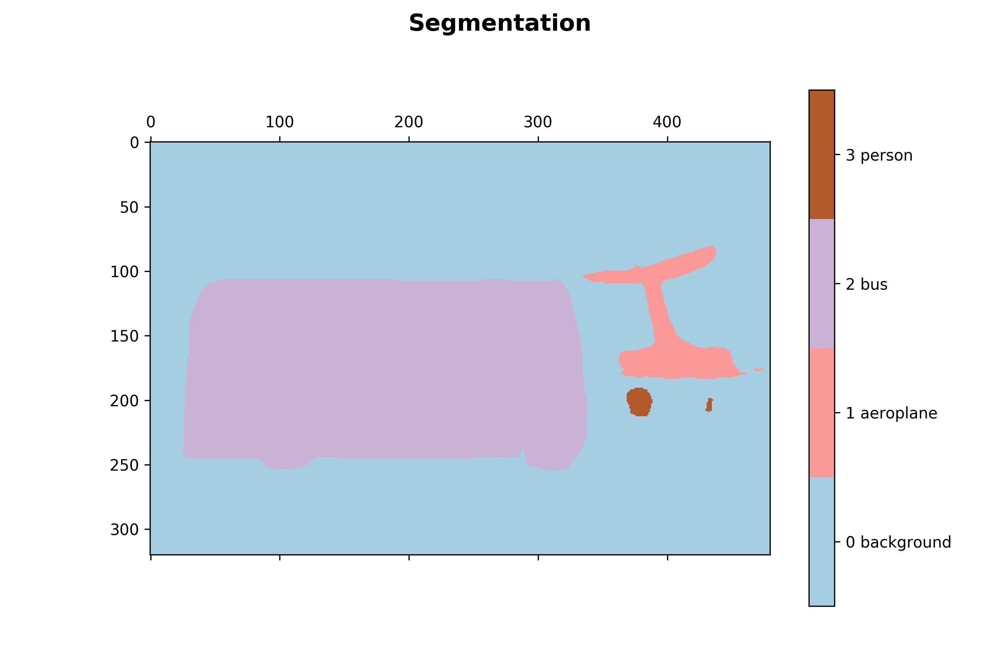
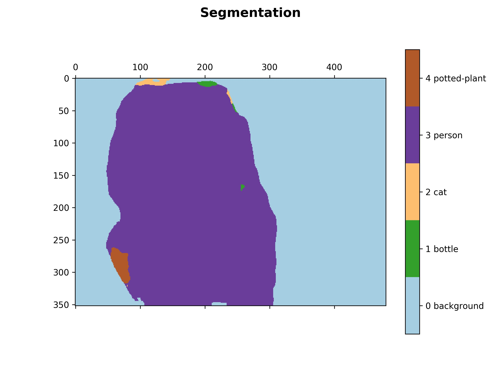
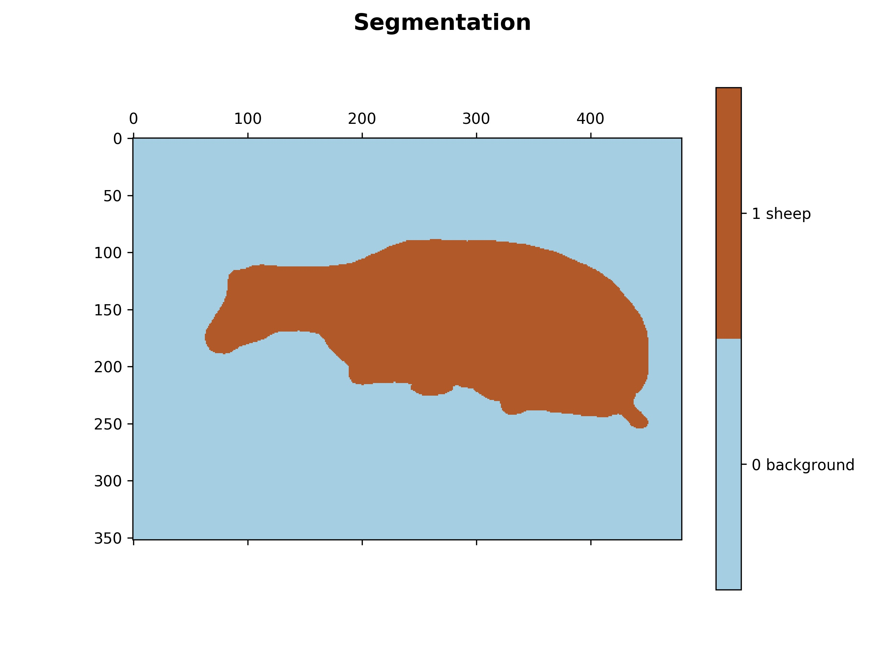
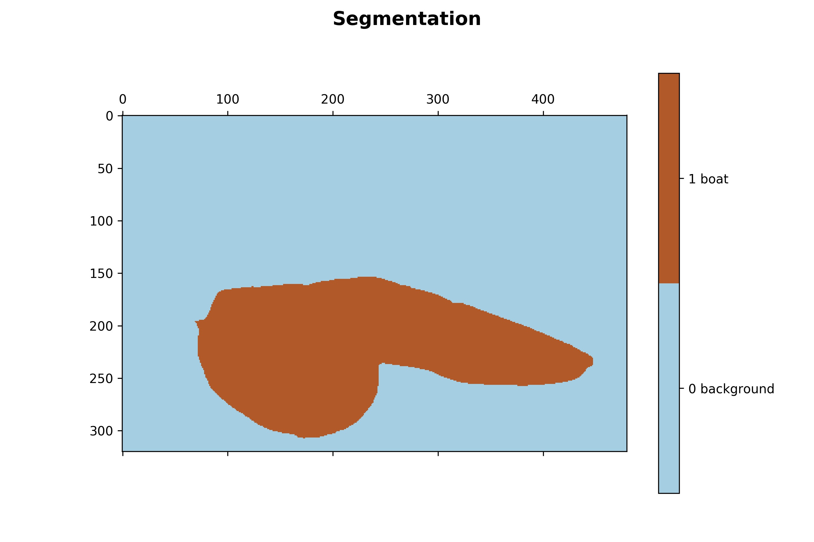
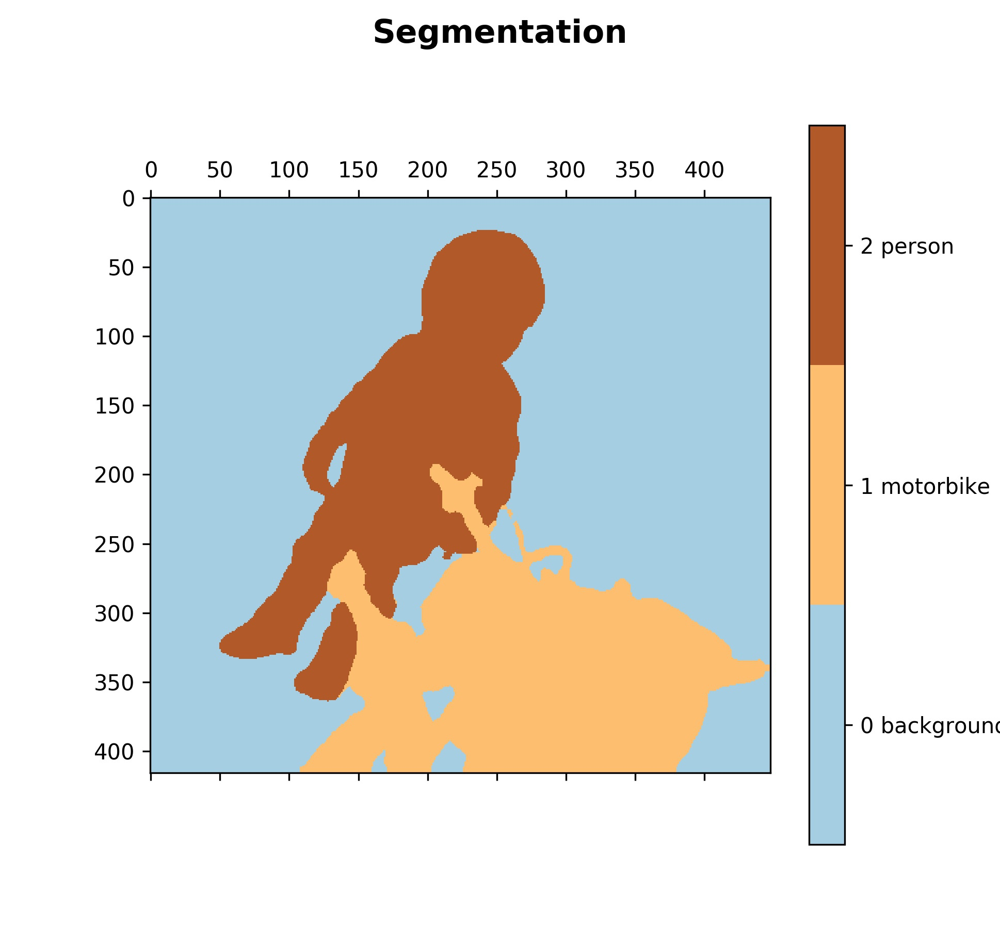
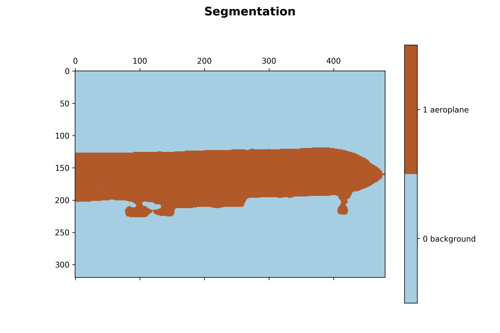

# refinenet
a tensorflow implement of refinenet ,RefineNet: Multi-Path Refinement Networks for High-Resolution Semantic Segmentation

## this is a tensorflow implement of refinenet discribed in [arxiv:1611.06612](https://arxiv.org/abs/1611.06612).
I have not finished it yet, but the model is already able to work.

## prepare
- download the pretrain model of resnet_v1_101.ckpt, you can download it from this [link](https://github.com/tensorflow/models/tree/master/slim)
- some dependence like cv2, numpy and etc. recommend to install Anaconda

## training
- first, run convert_pascal_voc_to_tfrecords.py to convert training data into .tfrecords. Currently, I only use the pascal voc 2012 for training, you can easily get this dataset from the internet. Or you can use the tfrecord I converted. See this [link](www.baidu.com).
- second, run python RefineNet/multi_gpu_train.py, also, you can change some hyper parameter in the file, like the batch size.

## eval
- if you have already got a model, or just download the model I trained on pascal voc.[model_final](www.baidu.com).
- put images in demo/ and run python RefineNet/demo.py 

## some result
See folder demo/ for the origin images

